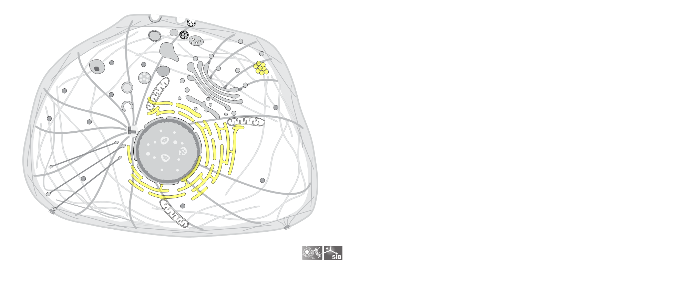

```{r setup, include=FALSE}
knitr::opts_chunk$set(echo = TRUE, message=FALSE, warning=FALSE,
                      comment="", digits = 3, tidy = FALSE, prompt = FALSE, fig.align = 'center')

```


# 세포 팩키지 [^cell-pkg] {#cell-pkg}

[^cell-pkg]: [`drawCell` - The goal of drawCell is to easily obtain nice cell pictures in R!](https://github.com/svalvaro/drawCell)

`drawCell()` 함수가 주요 역할을 담당하는 함수이며 두가지 인자가 중요하다.

- `taxonomy_id`: https://www.ncbi.nlm.nih.gov/taxonomy/
- `sl_ids`: http://current.geneontology.org/ontology/external2go/uniprotkb_sl2go

## 사례 {#case-study}

- Homo sapiens (Taxonomy id: 9606)
- Endoplasmic Reticulum (SL code: 0095) and lipid droplets (SL code: 0154)

```{r drawCell, eval = FALSE}
# devtools::install_github("svalvaro/drawCell")
library(drawCell)

drawCell(taxonomy_id = '9606', 
         sl_ids = c('0095','0154'), 
         color = 'yellow')
```



- 58334: Quercus ilex a common tree in the south of Spain
- 0049: the chloroplast

```{r drawCell-case2, eval = FALSE}
drawCell(taxonomy_id = '58334',
         sl_ids = '0049',
         size = 2000,
         color = 'lightblue')
```


